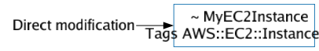
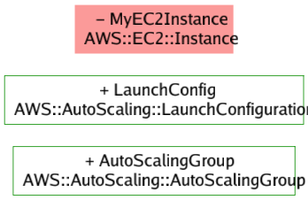

# Example changesets and their visualisations

_See <https://docs.aws.amazon.com/AWSCloudFormation/latest/UserGuide/using-cfn-updating-stacks-changesets-samples.html>_

## Modify a template directly

## Modify a stack through parameters

## Multiple modifications

## Adding and removing resources

